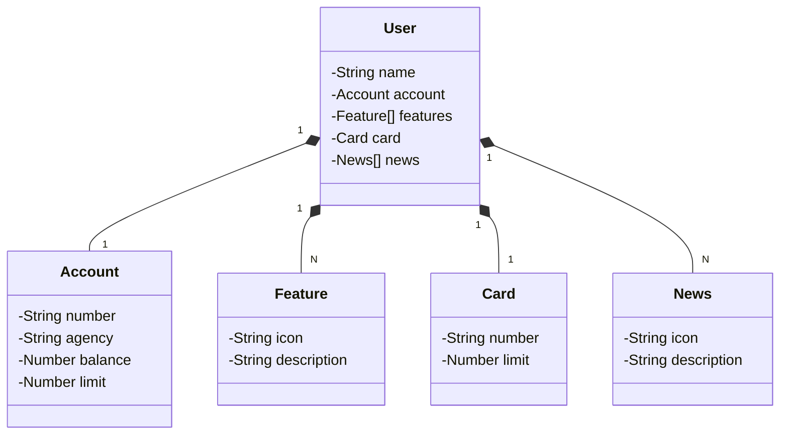

# Santander Dev Week 2023
Java RESTful API criada para a Santander Dev Week.

# [Link do Figma](https://www.figma.com/file/0ZsjwjsYlYd3timxqMWlbj/SANTANDER---Projeto-Web%2FMobile?type=design&node-id=1421-432&mode=design&t=cnIgTjts7iuhPiAE-0)

O Figma foi utilizado para a abstração do domínio desta API, sendo útil na análise e projeto da solução.

## Diagrama de Classes

# IMPORTANTE

Este projeto foi construido apartir de uma reprodução de um desafio da Digital Innovation One(DIO).

